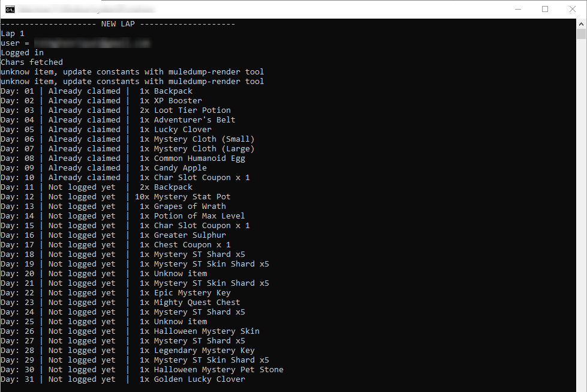
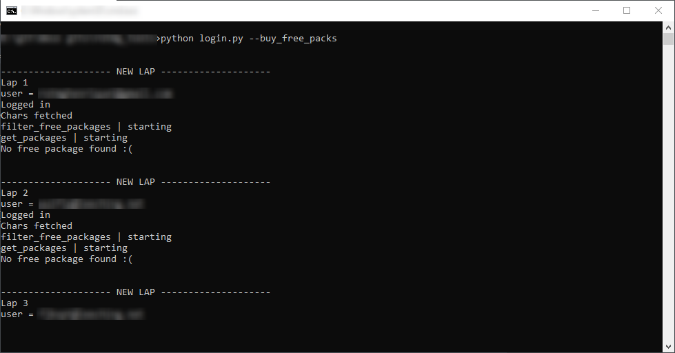

# rotmg_tools

some tools for realm of the mad god game

## How to update/create constants

Use [muledump render](https://github.com/BR-/muledump-render) to create the constants.js file

## How to use

Change accounts.json to use your accounts credentials, you can copy and paste your muledump accounts to accounts.json
Also, instead of using accounts.json you can pass email and password via arguments:  
`python login.py --email="your_account_mail" --password="your_pass_here"`

## What dos it do?

* It's suposed to log into your accounts (count as daily login)
* Can dumps account infos so you can parse later (data like muledump does, like items in vault, pots, gifts, fame)
* Buy free packages that are available

## Args
* constants = Path to constants.js
* accounts = Path to json of all accounts to do login, if not provided, use the file in app folder
* email = Email to login, use together with password, if provided, ignore accounts file
* password = Password to login, use together with email, if provided, ignore accounts file
* dumps = Extract account json infos muledump like to ./accounts/NAME.json
* buy_free_packs = Buy all 0 gold packages
* print_calendar_status = Show account calendar (logged days, claimed, calendar items)

### Args Examples

To use your muledump constants without generating a new one  
`python login.py --constants="path_to_your_muledump/lib/constants.js" --email="your_account_mail" --password="your_pass_here"`

To view your daily login calendar  
`python login.py --print_calendar_status --email="your_account_mail" --password="your_pass_here"`

Try to buy free packages  
`python login.py --buy_free_packs --email="your_account_mail" --password="your_pass_here"`

You can use it all together  
`python login.py --buy_free_packs --print_calendar_status --constants="path_to_your_muledump/lib/constants.js" --email="your_account_mail" --password="your_pass_here"`

If you have an accounts.json with multiple accounts, it will log and print calendar for each one, buy packs for each one...

# TO-DO

Add an arg to muledump accounts.js so you dont need to create accounts.json manually

